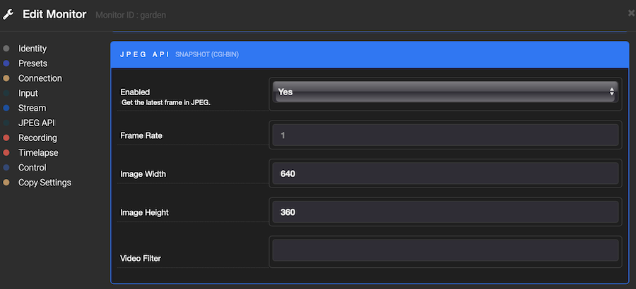

# homebridge-shinobi
> A [Homebridge](https://github.com/nfarina/homebridge) plugin integrating [Shinobi](https://shinobi.video) for motion detector cameras

# Installation
1. Install Homebridge using: `npm install -g homebridge`
2. Install this plugin: `npm install -g homebridge-shinobi`
1. Update your configuration file. See a sample `config.json` snippet below.
4. Ensure `ffmpeg` is installed and on the path.

**NOTE**: Currently there is no support for streaming audio from a camera.
 
# Configuration
Example `config.json` entry:

```
"platforms": [
    {
        "platform": "Shinobi",
        "shinobi_api": "http://x.x.x.x:8080",
        "api_key": "xxx",
        "group_key": "house",
        "monitors": [
            {
                "monitor_id": "front"
            },
            {
                "monitor_id": "rear"
            }
        ],
        "web_hook_port": "8443",
        "https_key_path": "/cert/privkey.pem",
        "https_cert_path": "/cert/fullchain.pem"
    }
]
```
Where:

* `shinobi_api` is the base URL for the [Shinobi API](https://shinobi.video/docs/api)
* `api_key` is the Shinobi API key (configured in the Shinobi dashboard API menu)
* `group_key` is a Shinobi group key
* `monitors` contains a list of monitors consisting of:
    * `monitor_id`
* `web_hook_port` is the port that the platform should listen on for motion event webhooks from Shinobi

If both `https_key_path` and `https_cert_path` are configured to point at HTTPS key and cert files available on the Homebridge
server the webhook server will be hosted on HTTPS.

#### Shinobi Integration

The specified `shinobi_api` and `api_key` will be used to make all Shinobi API requests.

Each of the specified `monitor` IDs will be used with the specified `group_key` to add a new accessory
to the platform consistent of a Motion Sensor service and camera.

When viewing video, the plugin will use the information returned from the API for a specific Monitor to determine
the source video stream configured. FFmpeg is used to stream directly from the camera and forward to HomeKit. If possible, 
the video will not be re-encoded.

Snapshot images for each Monitor are simply pulled from the Shinobi API. To ensure these are available, enable the JPEG API for
each configured Monitor:



A webhook URL should be configured for each Monitor within the Shinobi 'Global Detector Settings' with the following format:

`http[s]://<homebridge_ip>>:<web_hook_port>?mid=<monitors[index].monitor_id>&group=<group_key>` 

For example, assuming the Homebridge instance is available at 192.168.1.10 and using the above sample config,
the two Monitors `front` and `rear` would have webhook URLs configured as:  

`https://192.168.1.10:8443?mid=front&group=house` 

and

`https://192.168.1.10:8443?mid=rear&group=house` 

# Help etc.

If you have a query or problem, raise an issue in GitHub, or better yet submit a PR!

